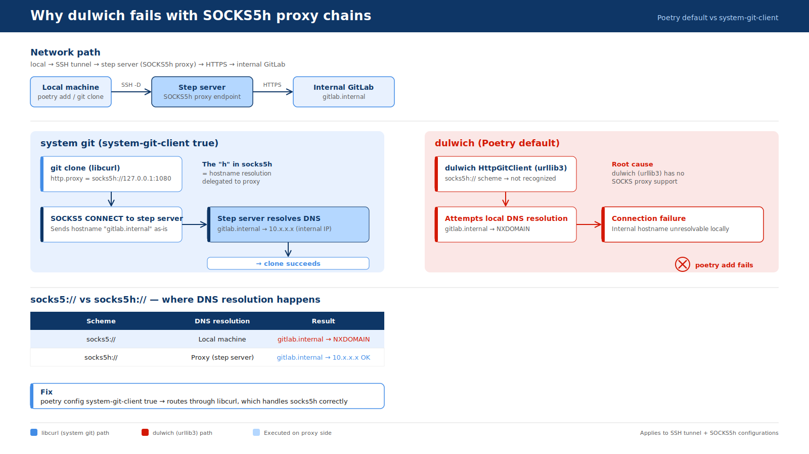

## 🔎 Objective

- You can already `git clone` from an internal GitLab (`gitlab.internal`) through an SSH tunnel acting as a SOCKS5h proxy.
- But when you run `poetry add git+https://gitlab.internal/...`, Poetry raises a connection error — even though nothing changed on the network side.
- Understand *why* the failure happens and apply the one-line fix.

[Network Path for Internal GitLab Access]{.mini-section}

```
local ─── SSH -D 1080 ──► step server ──► internal GitLab
          (SOCKS5h proxy)
```

## 🎯 Goal

- [ ] Understand why `git clone` succeeds but `poetry add` fails in the same network setup.
- [ ] Identify the role of dulwich (Poetry's default Git backend) in the failure.
- [ ] Fix the issue with `poetry config system-git-client true` (Poetry ≥ 2.0).

## TL;DR

Poetry uses **dulwich** (pure-Python Git) by default. Dulwich's HTTP client (urllib3)
does not support SOCKS proxies, so it cannot handle the `socks5h://` scheme your
SOCKS5h tunnel requires. Switching to the **system Git client** (libcurl) fixes it.

```bash
# Global: applies to all projects for the current user
poetry config system-git-client true

# Local: stored in poetry.toml (project-only)
poetry config --local system-git-client true
```

::: {.callout-note}
## Poetry version note

`system-git-client` was introduced as `experimental.system-git-client` in Poetry
**1.2.0** and **renamed to `system-git-client`** in Poetry **2.0.0**. The commands
above use the 2.0 name. On 1.x, replace `system-git-client` with
`experimental.system-git-client`.
:::


## The network path

```
local → SSH -D 1080 → step server (SOCKS5h) → HTTPS → gitlab.internal
```

The step server acts as a SOCKS5h proxy: you forward a local port through SSH, and
the step server performs both DNS resolution and the TCP connection to GitLab on your
behalf. The `h` suffix matters — it tells the proxy to resolve the hostname itself,
which is the only way `gitlab.internal` can be reached from outside the internal
network.




## Why `git clone` succeeds

When you run `git clone https://gitlab.internal/...` with

```ini
# ~/.gitconfig
[http "https://gitlab.internal"]
    proxy = socks5h://127.0.0.1:1080
```

the **system Git** client delegates HTTP(S) to **libcurl**. libcurl natively
understands `socks5h://`, so the flow looks like this:

```{mermaid}
flowchart LR
    A[git clone<br/>libcurl] -->|"① socks5h CONNECT<br/>sends hostname as-is"| B[localhost:1080<br/>SSH -D tunnel]
    B -->|SSH-encrypted| C[Step server]
    C -->|"② resolve gitlab.internal<br/>via internal DNS"| D[gitlab.internal:443]

    classDef app    fill:#e3eefc,stroke:#2c6cb0,color:#1a3c66
    classDef proxy  fill:#fff4d6,stroke:#b8860b,color:#5a4209
    classDef inside fill:#e2f0d9,stroke:#3a7d2b,color:#1f4d12
    class A app
    class B,C proxy
    class D inside
    style B fill:#fffbe9,stroke:#b8860b
```

libcurl forwards the bare hostname `gitlab.internal` to the proxy inside the SOCKS5
`CONNECT` request. The step server resolves it against the internal DNS and connects
to the real IP — the local machine never needs to resolve the hostname at all.


## Why `poetry add` fails (the dulwich problem)

By default, Poetry uses **dulwich** for all Git operations. Dulwich is a pure-Python
Git implementation that uses **urllib3** for HTTP(S) transport. urllib3 has no SOCKS
proxy support, and it does not recognise the `socks5h://` scheme.

The failure happens in two steps:

**Problem 1 — `socks5h://` scheme is unrecognised**

Dulwich's `HttpGitClient` passes the proxy URL to urllib3's `ProxyManager`. urllib3
only knows `http://` and `https://` proxy schemes. When it sees `socks5h://`, it
either ignores the proxy entirely or raises an error before any connection is made.

**Problem 2 — DNS resolution falls back to the local machine**

Without a working SOCKS proxy, urllib3 tries to resolve `gitlab.internal` on the
local machine. The hostname only exists in the internal DNS, so the local resolver
returns `NXDOMAIN` and the connection fails immediately.

```{mermaid}
flowchart LR
    A[poetry add<br/>dulwich / urllib3] -->|"socks5h:// → unrecognised<br/>falls back to local DNS"| B["gitlab.internal<br/>→ NXDOMAIN ✕"]

    classDef fail fill:#fde2e2,stroke:#c0392b,color:#7b1d1d
    class A,B fail
```

:::{.no-border-top-table}

| | system git (libcurl) | dulwich (urllib3) |
|---|---|---|
| Git backend | System `git` binary | Pure Python |
| SOCKS5h support | Native (libcurl) | None |
| DNS resolution | Delegated to proxy | Local — fails for `*.internal` |
| `git clone` works? | Yes | Yes (if `git.proxy` is set — dulwich *does* read `http.proxy` for plain HTTP/HTTPS schemes, but cannot handle SOCKS) |
| `poetry add` works? | **Yes** | **No** |

: {tbl-colwidths="[30,35,35]"}

:::

::: {.callout-tip}
## Why can dulwich sometimes handle `http.proxy`?

Dulwich does read `git config http.proxy` and passes it to urllib3. The problem is
not that dulwich ignores the proxy config — it's that urllib3 *only* supports
`http://` and `https://` proxy schemes. A `socks5h://` value is silently dropped,
leaving dulwich to resolve the hostname locally.
:::


## The fix

Switch Poetry to use the system Git client, which routes through libcurl and handles
`socks5h://` correctly.

```bash
# Poetry ≥ 2.0
poetry config system-git-client true          # global
poetry config --local system-git-client true  # project-local (writes poetry.toml)
```

You can verify the setting:

```bash
poetry config system-git-client
# true
```

After that, `poetry add git+https://gitlab.internal/org/repo.git` goes through the
same libcurl path as `git clone` and succeeds.

::: {.callout-warning}
## Prerequisite: `git` must be installed

With `system-git-client true`, Poetry calls the system `git` binary. If `git` is not
on `PATH`, Poetry will error out. In most development environments this is a
non-issue, but it matters for minimal Docker images built without Git.
:::


## Glossary

::: {.glossary-container}

```yml
- def: dulwich
  description: |
    A pure-Python Git implementation that does not depend on the system `git`
    binary or any native code. Poetry uses it by default to maximise portability.
    Its HTTP transport layer is built on urllib3, which currently has no SOCKS proxy
    support — the root cause of the `poetry add` failure in SOCKS5h environments.

- def: system-git-client
  description: |
    A Poetry configuration option (`poetry config system-git-client true`) that
    replaces dulwich with the system `git` binary for all Git operations.
    Introduced as `experimental.system-git-client` in Poetry 1.2.0 and renamed to
    `system-git-client` in Poetry 2.0.0. When enabled, Git HTTP(S) transport is
    handled by libcurl, which natively supports SOCKS5h proxies.

- def: SOCKS5
  description: |
    A proxy protocol that forwards raw TCP between a client and a server.
    Unlike an HTTP proxy it does not inspect or rewrite the payload,
    so HTTPS, SSH, and other TCP-based protocols pass through transparently.

- def: SOCKS5h
  description: |
    A SOCKS5 variant where the proxy server — not the client — performs
    DNS resolution. Required when the target hostname (e.g. `gitlab.internal`)
    only exists in an internal DNS that the local machine cannot reach.
    The trailing "h" stands for "hostname resolution on the proxy side."
```

:::


📘 References
---------

- [Poetry Documentation — `system-git-client`](https://python-poetry.org/docs/configuration/#system-git-client)
- [Dulwich Documentation](https://www.dulwich.io/docs/)
- [Git Documentation — `http.<url>.proxy`](https://git-scm.com/docs/git-config#Documentation/git-config.txt-httplturlgt)
- [RFC 1928 — SOCKS Protocol Version 5](https://www.rfc-editor.org/rfc/rfc1928)
