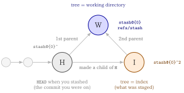

::: {.callout-note}
## TL;DR

- `git stash` lets you `pull` with dirty local changes
- `git stash pop` is all-or-nothing
- To take back **part** of a stash, extract it path by path or hunk by hunk instead of popping

:::{.code-area}

```bash
# step 1: -u also stashes untracked files
git stash push -u -m "wip"

# step 2
git pull

# step 3: check what is in there (only git-tracked files show up)
git stash show --name-only stash@{0}

# step 4: diff of one file
git diff 'stash@{0}^' 'stash@{0}' -- path/to/file

# step 5: pick hunks, worktree only
git restore -p --source='stash@{0}' -- path/to/file

# step 6: only once you are done
git stash drop stash@{0}
```

:::

- Extracting a path **overwrites** the working-tree file with the stash version. It is not a merge
- There is no command to directly add files to an existing stash

:::


## 🎯 Goal

- [ ] Stash local changes, `pull`, and inspect what the stash holds
- [ ] Diff a single file inside a stash
- [ ] Take back a stash file-by-file or hunk-by-hunk instead of popping the whole thing
- [ ] Review a stash in a GUI with `git difftool -d`


## 🔎 Objective

Suppose that 

1. you have uncommitted local changes and `git pull` refuses to run, or 
2. you simply do not want to merge upstream on top of a dirty tree. 

Then, the usual workflow is:

:::{.code-area}

```bash
git stash push -m "wip"
git pull
git stash pop
```

:::

### ⚠️ Problems

::: {.callout-note}
### What Really We Want

After pulling, how do you look inside the stash and take back **only the parts
you still want**?

:::

`git stash pop` is the problem. 

1. It replays the **entire** stash 
2. If the pull touched the same lines, hands you conflict markers across every file at once. 

Often you only wanted two of the five stashed files, and
the rest were scratch edits the upstream change has already made obsolete.


## How a stash is stored

A stash entry is not merely a temporary storage place for changed files, but a small **commit graph**, which is why you can address its parts
with ordinary commit syntax. The [git-stash documentation](https://git-scm.com/docs/git-stash)
describes it as:

> A stash entry is represented as a commit whose tree records the state of the working directory, and
> its first parent is the commit at `HEAD` when the entry was created. The tree of the second parent
> records the state of the index when the entry is made, and it is made a child of the `HEAD` commit.

and gives this ancestry graph, where `H` is the `HEAD` commit, `I` records the index and `W` records
the working tree:

{fig-align="center" width="88%"}

Arrows point from parent to child, so `W`'s two parents are `H` (first) and `I` (second), and those are exactly what `^1` and `^2` select.

`W` is what `stash@{0}` resolves to. So the two refs you need are:

:::{.no-border-top-table}

| Ref | Graph node | Holds | Use it to |
|---|---|---|---|
| `stash@{0}` | `W` | the working-tree state when you stashed | extract tracked files |
| `stash@{0}^` | `H` | the commit you were on (`HEAD` back then) | anchor a diff so *only your* changes show |
| `stash@{0}^2` | `I` | the index state when you stashed | recover what was staged |

: {tbl-colwidths="[20,14,36,30]"}

:::

Verify the shape yourself with:

:::{.code-area}

```bash
git log --oneline --graph stash@{0}
```

:::

### `git stash push` is equivalent to `git stash`

`push` is the full form of the save operation, and it is what every option in this
post attaches to. The [git-stash documentation](https://git-scm.com/docs/git-stash)
gives the synopsis as:

:::{.code-area}

```bash
git stash push [-p | --patch] [-S | --staged] [-k | --[no-]keep-index]
               [-u | --include-untracked] [-a | --all] [-q | --quiet]
               [(-m | --message) <message>]
               [--pathspec-from-file=<file> [--pathspec-file-nul]]
               [--] [<pathspec>...]
```

:::

> Save your local modifications to a new stash entry and roll them back to `HEAD`
> (in the working tree and in the index). The `<message>` part is optional and gives
> the description along with the stashed state.

So the two commands below do the same thing — `push` is the default subcommand and
may be omitted for a quick snapshot:

:::{.code-area}

```bash
git stash push -m "wip"    # explicit
git stash -m "wip"         # same thing
```

:::

[Why the docs still recommend spelling out `push`]{.mini-section}

The equivalence stops as soon as you pass a pathspec. Quoting the documentation:

> For quickly making a snapshot, you can omit "push". In this mode, pathspec elements
> are only allowed after a double hyphen `--` to prevent a misspelled subcommand from
> making an unwanted stash entry.

Without `push`, Git cannot tell a [pathspec](../2026-05-31-git-pathspec/index.qmd) from a subcommand you fumbled, so it
refuses rather than guessing:

:::{.code-area}

```bash
$ git stash a.txt
fatal: subcommand wasn't specified; 'push' can't be assumed due to unexpected token 'a.txt'
```

:::

That is a safety feature, not a bug. It is what stops `git stash puhs` or
`git stash lst` from silently stashing your whole working tree instead of erroring:

:::{.code-area}

```bash
$ git stash puhs
fatal: subcommand wasn't specified; 'push' can't be assumed due to unexpected token 'puhs'
```

:::

To limit a bare `git stash` to certain paths you must add `--`:

:::{.no-border-top-table}

| Command | Result |
|---|---|
| `git stash push a.txt` | stashes `a.txt` only |
| `git stash -- a.txt` | stashes `a.txt` only |
| `git stash a.txt` | **fatal** — `push` cannot be assumed |

: {tbl-colwidths="[42,58]"}

:::

Prefer `git stash push` whenever you pass a pathspec: it needs no `--`, and it makes
the command read the same as every other option-bearing form.

::: {.callout-tip}
## Options that select *what* gets stashed

`push` is also the only form that takes the narrowing options, all of which leave the
rest of your changes in the working tree:

:::{.no-border-top-table}

| Option | Stashes |
|---|---|
| `-p`, `--patch` | hunks you pick interactively |
| `-S`, `--staged` | only what is staged in the index |
| `-u`, `--include-untracked` | tracked changes **plus** untracked files |
| `-a`, `--all` | the above plus ignored files |
| `-k`, `--keep-index` | everything, but leaves the index intact in the worktree |

: {tbl-colwidths="[38,62]"}

:::

`-S` is the useful one when the operations side staged the YAML edits it wants to
keep and left scratch edits unstaged:

:::{.code-area}

```bash
$ git status --short
M  a.txt
 M b.txt

$ git stash -S -m "staged only"
Saved working directory and index state On main: staged only

$ git status --short
 M b.txt
```

:::
:::


### `-u`, `--include-untracked` option


::: {.callout-note}
### `-u` is short for `--include-untracked`

With `-u`, Git also stashes untracked files that are not currently tracked by Git.
Git collects these files into a separate commit and attaches it to the stash as an
additional parent.

:::

A stash created with `-u` has three parents.

What I did is

:::{.code-area}

```bash
## step 1: git init
git init

## step 2: add README.md and initial commit
touch README.md
git add README.md
git commit -m "initial commit"

## Step3: add mofitication to git-tracked file
echo fixed > README.md

## Step 4: create new file
touch esample.txt

## Step 5: git stash
git stash -u -m "wip"
```

:::

Then,

:::{.code-area}

```bash
% git log --oneline --graph stash@{0}
*-.   8afdbfe (refs/stash) On main: wip
|\ \  
| | * 6d00d09 untracked files on main: 5d1f1ea initial commit
| * 7bbada3 index on main: 5d1f1ea initial commit
|/  
* 5d1f1ea (HEAD -> main) initial commit

```


```bash
stash@{0}
├── parent 1 → HEAD before stashing
├── parent 2 → the tracked changes (the index)
└── parent 3 → the untracked files      # only with -u
```

:::

That third parent is addressable as `stash@{0}^3`, and it is the piece the `H`/`I`/`W` graph above
does not cover.


Three lines leave `8afdbfe`, so `stash@{0}` is not a single commit — it is a commit with three
parents:

:::{.code-area}

```bash
                 8afdbfe          <- stash@{0}
                /   |   \
               v    v    v
         5d1f1ea 7bbada3 6d00d09
            ^1      ^2      ^3
```

:::

:::{.no-border-top-table}

| Commit | Ref | Records |
|---|---|---|
| `5d1f1ea` | `stash@{0}^1` | the `HEAD` you were on before stashing |
| `7bbada3` | `stash@{0}^2` | the index(what was staged) |
| `6d00d09` | `stash@{0}^3` | the untracked files (**`-u` only**) |
| `8afdbfe` | `stash@{0}` | the stash itself — its tree is the working directory |

: {tbl-colwidths="[18,24,58]"}

:::


::: {.callout-note}
### Key Takeaways

untracked files are not stored in the `stash@{0}` body itself, but in the third parent `stash@{0}^3`

:::


[Inspecting the untracked commit]{.mini-section}

`^3` is an ordinary commit, so ordinary commit commands work on it:

:::{.code-area}

```bash
git show --stat stash@{0}^3          # which untracked files were stashed
git ls-tree -r --name-only stash@{0}^3   # full file list
```

:::


And a single file can be pulled straight out of it:

:::{.code-area}

```bash
git restore --source='stash@{0}^3' -- notes.md
```

:::

## 🔨 Walking through the operations case

Consider a Docker-based HTML hosting service. Two sides touch the same repository:

- the **development side** commits a new version and pushes it
- the **operations side** runs `git pull` to take that version, but also edits
  git-tracked YAML files directly to keep the service running

Both sides therefore end up editing the same tracked file:

:::{.code-area}

```text
                    config.yaml
                         │
        ┌────────────────┴────────────────┐
        │                                 │
  development side                 operations side
  committed and pushed             edited in place, uncommitted
        │                                 │
        └────────── same file ────────────┘
```

:::

Running `git pull` in that state either refuses outright or merges upstream on
top of a dirty tree. So the operations side stashes first.


### Step 1: stash local changes and pull

[Commands]{.mini-section}

:::{.code-area}

```bash
git stash push -m "wip"        # tracked modifications only
git stash push -u -m "wip"     # -u (--include-untracked) also stashes new files
git pull
```

:::


### Step 2: see what is inside the stash

[Commands]{.mini-section}

:::{.code-area}

```bash
git stash list                                # every entry
git stash show --name-only stash@{0}          # which tracked files changed
git stash show -p stash@{0}                   # full patch of tracked changes
git stash show --only-untracked --name-only stash@{0}   # the -u files
```

:::

::: {.callout-warning}
## `git stash show <stash> -- <path>` is not valid

The documented signature has no pathspec slot at all

:::{.code-area}

```bash
git stash show [-u | --include-untracked | --only-untracked] [<diff-options>] [<stash>]
```

:::

So a trailing path is read as a second revision:

:::{.code-area}

```bash
$ git stash show -p 'stash@{0}' -- a.txt
Too many revisions specified: 'stash@{0}' 'a.txt'
```

:::

For a single file, diff the stash against its parent instead:

:::{.code-area}

```bash
# comapre stash with its parent
git diff 'stash@{0}^' 'stash@{0}' -- path/to/file

# comapre stash with the HEAD
git diff HEAD 'stash@{0}'
```


:::
:::

[Why `stash@{0}^` and not `HEAD`]{.mini-section}

After a `pull`, `HEAD` has moved. Diffing against `HEAD` mixes *your* stashed edits with everything
the pull brought in. `stash@{0}^` is the commit you were sitting on when you stashed, so it isolates
your own changes:

:::{.no-border-top-table}

| Command | Shows |
|---|---|
| `git diff 'stash@{0}^' 'stash@{0}'` | only the changes you stashed |
| `git diff HEAD 'stash@{0}'` | your changes **plus** everything the pull added, inverted |
| `git diff 'stash@{0}'` | stash vs your current working tree |

: {tbl-colwidths="[46,54]"}

:::


### Step 3: take back only part of the stash

#### **File by file**

[Commands]{.mini-section}

:::{.code-area}

```bash
# modern form — worktree only, index untouched
git restore --source='stash@{0}' -- path/to/file

# legacy form — writes the worktree AND stages the file
git checkout 'stash@{0}' -- path/to/file
```

:::

The two differ in what they touch:

:::{.no-border-top-table}

| Command | `git status` afterwards | Index |
|---|---|---|
| `git restore --source=<stash> -- <path>` | ` M path` | untouched |
| `git checkout <stash> -- <path>` | `M  path` | staged |

: {tbl-colwidths="[46,27,27]"}

:::

#### **Hunk by hunk**

When a single file holds both edits you want and edits you don't, add `-p`:

:::{.code-area}

```bash
git restore -p --source='stash@{0}' -- path/to/file
```

:::

Git walks you through each hunk:


:::{.code-area}
```bash
@@ -1 +1,2 @@
 a
+a2
(1/1) Apply this hunk to index and worktree [y,n,q,a,d,e,?]?
```
:::

Answer `y` to take a hunk, `n` to skip it, `e` to edit it by hand, `q` to stop.

#### **Untracked files**

The main stash commit does not contain untracked paths, so the obvious command fails:

:::{.code-area}

```bash
$ git restore --source='stash@{0}' -- path/to/new-file
error: pathspec 'path/to/new-file' did not match any file(s) known to git
```

:::

Those files sit on the undocumented third parent, so extraction needs `^3`:

:::{.code-area}

```bash
git restore --source='stash@{0}^3' -- path/to/new-file
```

:::

If you want *all* of them back rather than one path, `git stash pop` restores untracked files
along with everything else, and it avoids relying on `^3`.


### Step 3 (Optional): take everything back with a merge

Step 3 extracts by path, and extraction **overwrites**: `git restore --source=<stash> -- <file>` and
`git checkout <stash> -- <file>` replace the working-tree file wholesale with the stash version.

When upstream also touched the file, you want a real three-way merge instead:

[Commands]{.mini-section}

:::{.code-area}

```bash
# merge the stash into the working tree, then drop the entry
git stash pop

# same merge, but keeps the stash entry
git stash apply
```

:::

`pop` replays the stash on top of the post-`pull` tree. Where the two sides changed different lines
Git merges them for you; where they collide you get ordinary conflict markers to resolve:

:::{.code-area}

```bash
$ git stash pop
Auto-merging config.yaml
CONFLICT (content): Merge conflict in config.yaml
```

:::

::: {.callout-warning}
## A conflicting `pop` does not drop the stash

- On conflict the entry stays in the list, so nothing is lost. You need resolve the markers, then
`git stash drop stash@{0}` yourself
- A clean `pop`, by contrast, drops it for you
- Use `git stash apply` when you would rather keep the entry either way.

:::

`pop` is also the way to get *all* untracked files back at once, without relying on the `^3` parent
from Step 3.

If you are unsure which side touched what, inspect first with the `git diff 'stash@{0}^'
'stash@{0}'` command from Step 2, or hand-pick hunks with `git restore -p`, which shows you the
conflict-prone lines before you accept them.

### Step 4: clean up

[Commands]{.mini-section}

:::{.code-area}

```bash
git stash drop stash@{0}   # once you have everything you need
```

:::

Extracting files by path leaves the stash entry intact — unlike `pop`, nothing is consumed. Drop it
only after you have confirmed the working tree holds what you want, because `drop` is **not undoable**
through the `stash` UI.

::: {.callout-tip}
## A dropped stash is recoverable for a while

The documentation is blunt that dropped entries "cannot be recovered through the normal safety
mechanisms", but offers this incantation to list stash commits that are still in the repository and
merely unreachable:

:::{.code-area}

```bash
git fsck --unreachable |
grep commit | cut -d\  -f3 |
xargs git log --merges --no-walk --grep=WIP
```

:::

Then revive one with `git stash apply <sha>`.

Note the `--grep=WIP` filter only matches the **default** stash message (`WIP on <branch>`). If you
stashed with `-m "wip"`, the message becomes `On <branch>: wip` and this command silently finds
nothing. Drop the `--grep` to see every unreachable merge commit:

:::{.code-area}

```bash
git fsck --unreachable |
grep commit | cut -d\  -f3 |
xargs git log --merges --no-walk --oneline
```

:::
:::


## Reviewing a stash in a GUI with `difftool`

`git difftool` takes the same arguments as `git diff`, so every form above works with a visual tool.

[Commands]{.mini-section}

:::{.code-area}

```bash
# only your stashed changes
git difftool 'stash@{0}^' 'stash@{0}'

# one file
git difftool 'stash@{0}^' 'stash@{0}' -- path/to/file

# stash vs current worktree
git difftool 'stash@{0}'

# whole change set at once
git difftool -d 'stash@{0}^' 'stash@{0}'
```

:::

`-d` (`--dir-diff`) is the one that matters here: instead of prompting per file, it materialises both
sides into temporary directories and opens the tool once. In VS Code you get a side-by-side tree of
every stashed file, which is how you decide what to extract before running the commands from Step 3.


## Summary: Choosing between the approaches

:::{.no-border-top-table}

| Situation | Command |
|---|---|
| Want the whole stash back, upstream didn't touch it | `git stash pop` |
| Want the whole stash back, upstream **did** touch it | `git stash pop`, then resolve conflicts |
| Want a few files, upstream didn't touch them | `git restore --source='stash@{0}' -- <paths>` |
| Want some hunks within a file | `git restore -p --source='stash@{0}' -- <file>` |
| Want one untracked file back | `git restore --source='stash@{0}^3' -- <file>` (undocumented) |
| Just want to look before deciding | `git difftool -d 'stash@{0}^' 'stash@{0}'` |

: {tbl-colwidths="[52,48]"}

:::


## Glossary

::: {.glossary-container}

```yml
- def: stash entry
  description: |
    A commit whose tree records the working directory. Its first parent
    is the HEAD at stash time; its second parent records the index.
    A -u stash also gets an undocumented third parent holding the
    untracked files.

- def: stash@{0}
  description: |
    Reflog syntax for the most recent entry; refs/stash holds the
    latest and older ones live in its reflog. `stash@{2.hours.ago}`
    works too, and a bare integer n is equivalent to stash@{n}.
    Quote it in zsh/bash so the braces survive.
```

:::


📘 References
---------

- [Git Documentation > git-stash](https://git-scm.com/docs/git-stash)
- [Git Documentation > git-restore](https://git-scm.com/docs/git-restore)
- [Git Documentation > git-difftool](https://git-scm.com/docs/git-difftool)
