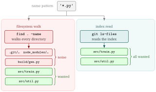

::: {.callout-note}
## TL;DR

- Git has no `git find` subcommand. The equivalent is **`git ls-files`**, which lists paths from the index instead of walking directories

:::{.code-area}

```bash
# the git-native equivalent: tracked + untracked, .gitignore honoured
git ls-files --cached --others --exclude-standard | grep '\.py$'
```

:::

:::


## 🎯 Goal

- [ ] Search file **names** with `git ls-files`
- [ ] Pick the right `git ls-files` scope: tracked, untracked, or everything
- [ ] Understand why `-z` matters — `git ls-files` **quotes** unusual paths by default


## 🔎 Objective

Suppose that you want every Python file in a repository. Git ships `git grep` for
searching **contents**, but there is no `git find` for searching **names**.

:::{.code-area}

```bash
$ find . -name '*.py'
./src/train.py
./src/util.py
./build/gen.py                 # ⚠️ .gitignore'd build output
```

:::

`find` has no idea it is inside a repository, so you start bolting on exclusions `-not -path './build/*'`, then

```bash
$ find . -name '*.py' -not -path './build/*'
./src/train.py
./src/util.py
```

But there are several problems:

:::{.no-border-top-table .pb-3}

| Problem | Consequence |
|---|---|
| `find` does not read `.gitignore` | Build output and caches pollute the results |
| Every exclusion is manual | The `-not -path` list drifts out of sync with `.gitignore` |
| No notion of "tracked" | You cannot ask for *only* files Git is versioning |

: {tbl-colwidths="[42,58]"}

:::

[What Really We Want]{.mini-section}

- A name search scoped to the files **Git already knows about**
- With the ignore rules applied by Git rather than by flags you have to remember, and a way to say
*tracked only*, *untracked only*, or *everything*.


## Solution: `git ls-files` is the `git find` you are looking for

[Key Takeaways]{.mini-section}

- `find` walks directories
- `git ls-files` reads the **index**, i.e., the list of paths Git already tracks

{fig-align="center" width="78%"}

The three scope flags are the whole vocabulary you need:

:::{.no-border-top-table .pb-3}

| Flag | Lists |
|---|---|
| `--cached` | Files **in the index** (i.e. tracked). The default when no flag is given |
| `--others` | Files in the working tree that are **not** in the index (untracked) |
| `--exclude-standard` | Apply `.gitignore`, `.git/info/exclude`, and the global excludes file |
| `--deduplicate` | Collapse the duplicate paths `--cached` emits during a merge conflict |
| `-z` | NUL-terminate each path instead of newline, and **stop quoting** |

: {tbl-colwidths="[28,72]"}

:::

::: {.callout-warning}
## `--others` without `--exclude-standard` lists every ignored file

The two flags must travel together.

- `--others` means "not in the index", and ignored files are not in the index
- `git ls-files --others` alone is *worse* than `find`, because it hands you every generated
and vendored file in full.

:::


### The four scopes, side by side

Given a repository that ignores `build/`, with `my file.py` untracked:

:::{.code-area}

```bash
$ git ls-files --cached --others --exclude-standard | grep '\.py$'
my file.py                     # untracked, but not ignored
src/train.py
src/util.py

$ git ls-files --cached | grep '\.py$'                  # tracked only
src/train.py
src/util.py

$ git ls-files --others --exclude-standard | grep '\.py$'   # untracked only
my file.py

$ git ls-files --cached --others | grep '\.py$'         # + ignored
build/gen.py
my file.py
src/train.py
src/util.py
```

:::

Note the last one drops `--exclude-standard`, which is what lets `build/gen.py` back in.
That is the whole mechanism: **the scope is the flag combination**, and there is nothing
else to remember.

[Narrowing by directory]{.mini-section}

Everything after `--` is a [pathspec](../2026-05-31-git-pathspec/index.qmd), so the name
search composes with Git-native path matching:

:::{.code-area}

```bash
$ git ls-files --cached --others --exclude-standard -- docs | grep '\.md$'
docs/README.md
docs/guide.md

# a pathspec can also exclude
$ git ls-files -- ':(exclude)tests/' | grep '\.py$'
src/train.py
src/util.py
```

:::

[Feeding the result into another command]{.mini-section}

`grep -z` keeps the NUL separators that `git ls-files -z` produces, so the whole pipeline
stays safe for `xargs -0`:

:::{.code-area}

```bash
# count the lines of every tracked shell script
$ git ls-files -z --cached | grep -z '\.sh$' | xargs -0 wc -l

# how many matches?
$ git ls-files --cached --others --exclude-standard | grep -c '\.py$'
3
```

:::

::: {.callout-warning}
## `--cached` can list the same path more than once

During a merge conflict the index holds **multiple stages** of the same path, and
`git ls-files --cached` prints one line per stage:

```bash
$ git ls-files --cached | grep conflict.txt
conflict.txt                   # stage 1: merge base
conflict.txt                   # stage 2: ours
conflict.txt                   # stage 3: theirs
```

`git ls-files` has a flag for this, **`--deduplicate`**, so you do not need to reach for
an external filter:

```bash
$ git ls-files --cached --deduplicate | grep conflict.txt
conflict.txt
```

It works under `-z` too, and applies to the `--deleted`/`--modified` overlap for the same
reason. But be careful that

- `--deduplicate` only has an effect when **filenames alone** are shown 
- combined with `-t`, `--unmerged`, or `--stage`, each line carries its stage information, so
Git keeps every line.
:::


### Why `-z` is not optional

`git ls-files` **quotes** paths containing unusual bytes when writing newline-delimited output, because a raw newline in a filename would break the format. So a naive one-liner silently drops the file it most needs to find:

:::{.code-area}

```bash
# a file whose name contains a newline
$ git ls-files --others --exclude-standard
src/train.py
src/util.py
"weird\nname.py"                     # ⚠️ quoted, and \n is now two characters

$ git ls-files --others --exclude-standard | grep '\.py$'
                                     # ⚠️ nothing: the line ends in a quote

$ git ls-files -z --others --exclude-standard \
      | grep -z '\.py$' | xargs -0 -n1 echo 'GOT:'
GOT: my file.py
GOT: src/train.py
GOT: src/util.py
GOT: weird
name.py                              # ✅ matched, one argument
```

:::

Under `-z` Git emits the bytes verbatim, no quoting, NUL as the separator. The `-z` has to
travel all the way down the pipeline: `grep -z` to keep the separators, then `xargs -0` to
split on them. Drop it from any one stage and the newline-in-a-filename case breaks again.

## Commonly used recipes

:::{.no-border-top-table}

| Goal | Command |
|---|---|
| Tracked + untracked, ignore-aware | `git ls-files --cached --others --exclude-standard` |
| Tracked only | `git ls-files` |
| Untracked only | `git ls-files --others --exclude-standard` |
| Everything, ignored included | `git ls-files --cached --others` |
| Just the ignored files | `git ls-files --others --ignored --exclude-standard` |
| Tracked, no merge-stage duplicates | `git ls-files --cached --deduplicate` |
| Tracked **directories** | `git ls-tree -d -r --name-only HEAD` |
| Count matches | `git ls-files ... \| grep -c '<pattern>'` |
| Feed into a command safely | `git ls-files -z ... \| grep -z '<pat>' \| xargs -0 -r <cmd>` |
| Same, ignore-aware, non-git | `fd '<pattern>'` |

: {tbl-colwidths="[38,62]"}

:::

::: {.callout-tip}
## Name search vs content search

- a **name** matches a pattern → `git ls-files`, e.g. `git ls-files | grep '\.py$'`
- a **path** matches a Git-native pattern → [pathspec](../2026-05-31-git-pathspec/index.qmd), e.g. `git add ':(glob)src/**/*.py'`

`git ls-files` takes a pathspec after `--`, so the first and third compose:
`git ls-files -- ':(exclude)tests/' | grep '\.py$'`.
:::


## Appendix: wrapping it in `git-find.sh`

The `git ls-files` plus a `grep` pipeline is short
enough to type, but the scope flags are easy to get wrong, so it is worth naming the four
combinations once. [`git-find.sh`](https://github.com/RyoNakagami/regmonkey-gitcommand/blob/main/src/git-find.sh) does that and adds NUL-safe output.

<strong > &#9654;&nbsp; Usage</strong>

:::{.code-area}

```bash
./git-find.sh '<pattern>'                 # tracked + untracked, gitignore honoured
./git-find.sh -t '\.py$'                  # tracked only
./git-find.sh -u '\.py$'                  # untracked only
./git-find.sh -a '\.py$'                  # everything, including ignored files
./git-find.sh -i 'readme'                 # case-insensitive
./git-find.sh -F 'src/lib.sh'             # literal match, no regex
./git-find.sh -c '\.sh$'                  # count matches
./git-find.sh -z '\.sh$' | xargs -0 wc -l # pipe safely into xargs
./git-find.sh '\.md$' -- docs             # limit the search to docs/
```

:::

<strong > &#9654;&nbsp; Options</strong>

:::{.no-border-top-table .pb-3}

| Option | Effect |
|---|---|
| `-t`, `--tracked` | Tracked files only (`--cached`) |
| `-u`, `--untracked` | Untracked-but-not-ignored only (`--others --exclude-standard`) |
| `-a`, `--all` | Tracked + untracked **including** ignored files |
| `-i`, `--ignore-case` | Case-insensitive pattern match |
| `-F`, `--fixed-strings` | Treat the pattern as a literal string, not a regex |
| `-c`, `--count` | Print only the number of matching paths |
| `-z`, `--null` | NUL-separate output, safe for `xargs -0` |
| `-h`, `--help` | Print the header block as usage text |

: {tbl-colwidths="[26,74]"}

:::

Scope flags are mutually exclusive, and so are `-c` and `-z`:

:::{.code-area}

```bash
$ ./git-find.sh -t -u '\.py$'
Error: -t and -u are mutually exclusive.

$ ./git-find.sh -c -z '\.py$'
Error: -c and -z are mutually exclusive.
```

:::

## 📘 Glossary

::: {.glossary-container}

```yml
- def: git ls-files
  description: |
    Lists paths Git knows about, read from the index rather than by
    walking directories. Scope is set by `--cached` (tracked),
    `--others` (untracked), and `--exclude-standard` (apply ignore
    rules).

- def: git grep
  description: |
    Searches file **contents** within the repository — the counterpart
    to `git ls-files`, which searches **names**. Like `ls-files` it is
    repository-aware: it looks at tracked files only by default (add
    `--untracked` to include untracked ones) and never descends into
    ignored paths. `-l` prints just the matching filenames, which is
    what makes it composable with `xargs`.
```

:::


📘 References
---------

- [Git Documentation > git-ls-files](https://git-scm.com/docs/git-ls-files)
- [Git Documentation > git-grep](https://git-scm.com/docs/git-grep)
- [regmonkey-gitcommand repository](https://github.com/RyoNakagami/regmonkey-gitcommand)
- [OGG... What is a git pathspec and how do I use its magic signatures?](../2026-05-31-git-pathspec/index.qmd)
