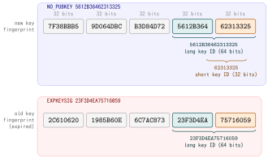

::: {.callout-note}
## TL;DR

- The GitHub CLI APT repository signing key was rotated. The old key expired on **2026-09-05**
- Your local keyring still holds only the old key, so `apt update` refuses the `gh` repository
- Replace the `gh` keyring, in the path your source entry actually points at, then update the index and upgrade `gh`
- Only APT and RPM installs are affected: a `gh` installed through Homebrew, a binary from GitHub Releases, or a source build never touches this keyring and needs no action.

:::{.code-area}

```bash
$ gh --version
gh version 2.100.0 (2026-09-03)
https://github.com/cli/cli/releases/tag/v2.100.0
```

:::

:::

## 🔎 Problem

Suppose that `apt update` starts complaining about the GitHub CLI repository, while every
other repository updates fine:

:::{.code-area}

```bash
$ sudo apt update
...
W: An error occurred during the signature verification. The repository is not updated and the previous index files will be used. GPG error: https://cli.github.com/packages stable InRelease: The following signatures were invalid: EXPKEYSIG 23F3D4EA75716059 GitHub CLI <opensource+cli@github.com> The following signatures couldn't be verified because the public key is not available: NO_PUBKEY 5612B36462313325
W: Failed to fetch https://cli.github.com/packages/dists/stable/InRelease  The following signatures were invalid: EXPKEYSIG 23F3D4EA75716059 GitHub CLI <opensource+cli@github.com> The following signatures couldn't be verified because the public key is not available: NO_PUBKEY 5612B36462313325
W: Some index files failed to download. They have been ignored, or old ones used instead.

```

:::

Nothing is broken system-wide.
But the point is **`gh` can no longer be updated**, and the warning reappears on
every `apt update`.

### Why the two lines are different failures

The message looks like one problem repeated twice. It is two, and reading them apart is
what tells you the fix is a keyring swap rather than a source-list edit.

:::{.no-border-top-table .pb-3}

| Line | What it means |
|---|---|
| `EXPKEYSIG 23F3D4EA75716059` | The signature **verified** against a key you hold, with fingerprint `2C6106201985B60E6C7AC87323F3D4EA75716059`<br> The key **expired** at `2026-09-05T12:44:10Z` |
| `NO_PUBKEY 5612B36462313325` | The repository is **also** signed with a new key, `7F38BBB59D064DBCB3D84D725612B36462313325`, and that public key is **not in your local keyring** |

: {tbl-colwidths="[34,66]"}

:::

Put together, they describe a single state: GitHub rotated the signing key, published an
updated keyring file containing **both** keys on **2026-04-08**, and your machine installed
`gh` before that date and never re-ran the setup steps. The old key carried you until it
expired, and today it no longer does.

### Check the GitHub CLI APT keyring

APT repository keyring files are typically stored under
`/etc/apt/keyrings/`.

For the GitHub CLI repository, check the keyring with:

:::{.code-area}

```bash
gpg --show-keys /etc/apt/keyrings/githubcli-archive-keyring.gpg
```

:::

Then, you will see

:::{.code-area}

```bash
pub   rsa4096 2022-09-06 [SC] [expired: 2026-09-05]
      2C6106201985B60E6C7AC87323F3D4EA75716059
uid                      GitHub CLI <opensource+cli@github.com>
sub   rsa4096 2022-09-06 [E] [expired: 2026-09-05]

gpg: WARNING: No valid encryption subkey left over.
```

:::

The `gpg --show-keys` command displays information stored in the
specified keyring file, including the public key fingerprint, user ID,
subkeys, and expiration dates.

In this case, the fingerprint is:

:::{.code-area}

```bash
2C6106201985B60E6C7AC87323F3D4EA75716059
```

:::

Its suffix, `23F3D4EA75716059`, matches the key ID reported by APT in an
`EXPKEYSIG` error:

:::{.code-area}

```bash
EXPKEYSIG 23F3D4EA75716059
```

:::

This confirms that the expired key reported by APT is the same GitHub CLI
repository key stored in `/etc/apt/keyrings/githubcli-archive-keyring.gpg` (For more detail, see [Appendix](index.qmd#appendix-the-key-id-is-not-a-separate-value))


## 🔨 Solution: replace the keyring file


::: {.callout-note}
### Commands

:::{.code-area}

```bash
sudo wget -qO /etc/apt/keyrings/githubcli-archive-keyring.gpg https://cli.github.com/packages/githubcli-archive-keyring.gpg \
    && sudo chmod go+r /etc/apt/keyrings/githubcli-archive-keyring.gpg

sudo apt update
sudo apt install --only-upgrade gh
```

:::

:::

[Check your local keyrings]{.mini-section}

:::{.code-area}

```bash
$ gpg --show-keys /etc/apt/keyrings/githubcli-archive-keyring.gpg
pub   rsa4096 2022-09-06 [SC] [expired: 2026-09-05]
      2C6106201985B60E6C7AC87323F3D4EA75716059
uid                      GitHub CLI <opensource+cli@github.com>
sub   rsa4096 2022-09-06 [E] [expired: 2026-09-05]

gpg: WARNING: No valid encryption subkey left over.
pub   rsa4096 2026-04-07 [SC]
      7F38BBB59D064DBCB3D84D725612B36462313325
uid                      GitHub CLI <opensource+cli@github.com>
sub   rsa4096 2026-04-07 [E]

```

:::

- Two `pub` entries mean the swap worked; the expired one is expected to still be there, since the repository metadata is signed by both.
- **One `pub` entry means you might still be holding the old keyring**, so re-check the path from `signed-by=`.

After checking your keyrings, update the apt repository index with `apt update`.

[Upgrade and check]{.mini-section}

Before running `apt upgrade`, the version would look like

```bash
$ gh --version
gh version 2.97.0 (2026-07-31)
https://github.com/cli/cli/releases/tag/v2.97.0
```

After upgrading (as of 2026-09-07):

```bash
$ gh --version
gh version 2.100.0 (2026-09-03)
https://github.com/cli/cli/releases/tag/v2.100.0
```


## 📘 Appendix: The key ID is not a separate value

The 16-digit ID in the error message and the 40-digit fingerprint are not two different
identifiers. A **key ID is a suffix of the fingerprint**: the long key ID is its low 64
bits, i.e. the last 16 hex digits, and the short key ID is the low 32 bits, the last 8.

{fig-align="center" width="88%"}

So `NO_PUBKEY 5612B36462313325` and the fingerprint
`7F38BBB59D064DBCB3D84D725612B36462313325` refer to the same key,
and the same holds for the expired one.


References
----------
- [Upcoming PGP signing key rotation for GitHub CLI Linux packages [September 2026] #13118](https://github.com/cli/cli/issues/13118#new-users)
- [GitHub CLI > Installation on Linux and BSD](https://github.com/cli/cli/blob/trunk/docs/install_linux.md)
