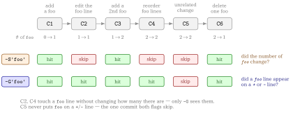

::: {.callout-note}
## TL;DR

- `git grep` searches the **current** working tree. To search **history**, you need `git log -G <regex>`, which matches commits who add or remove a line matching the regex
- Use `--name-status` to see which paths each of those commits touched
- Use `--diff-filter` to keep only additions, modifications, deletions, or renames

:::{.code-area}

```bash
# every commit in the last 20 whose patch touches a TODO, with the affected paths
git log -G 'TODO' --format='commit %h' --name-status HEAD~20..HEAD
```

:::

:::


## 🎯 Goal

- [ ] Search commit **history** for a string with `git log -G`, not just the working tree
- [ ] Group the result as *commit → the files it changed* with `--name-status`
- [ ] Narrow the result to a change type (added / modified / deleted / renamed) with `--diff-filter`
- [ ] Wrap the whole pipeline in `git-grep-commit` when you want machine-readable output


## 🔎 Objective

Suppose that a `TODO` marker used to exist somewhere in the repository and is now gone. You
want to know **which commit removed it, and from which file**.

[`git grep` cannot answer this]{.mini-section}

`git grep` searches a single tree:

:::{.code-area}

```bash
# ⚠️ nothing: the string is gone from HEAD
$ git grep 'TODO' 
```

:::

[`git log -G` searches history]{.mini-section}

The default output tells you the commits and
nothing about the files:

:::{.code-area}

```bash
# ⚠️ which files? unknown
$ git log -G 'TODO' --oneline HEAD~20..HEAD
9f2c1ab Drop the leftover TODO markers
3ad77e0 Add TODO for the retry path
```

:::

And once you add `--name-status`, the output is correct but not something another program
can read:

:::{.code-area}

```bash
$ git log -G 'TODO' --name-status HEAD~20..HEAD
commit 9f2c1ab...
Author: ...
Date: ...

    Drop the leftover TODO markers

D       src/legacy.py
M       src/worker.py
...
```

:::

[What Really We Want]{.mini-section}

- One record per commit, with the affected paths nested under it
- A way to say "only the commits that **added** it" versus "only the ones that **deleted** it"
- Output that survives a pipe, JSON or YAML, and filenames that do not break the format


## Search Options: `-S` or `-G`

`git log` has two flags that search the patch instead of the tree.

:::{.no-border-top-table .pb-3}

| Flag | Selects commits where |
|---|---|
| `-S <string>` | Look for differences that change the number of occurrences of the specified string |
| `-G <regex>` | Display commits where lines matching the regex were added or deleted in diff |

: {tbl-colwidths="[25,75]"}

:::

The practical difference: a commit that moves a line containing `TODO` from one file to
another changes no occurrence count, so `-S` skips it, while `-G` reports it because both a
`+` line and a `-` line matched.

::: {.callout-note}
## `-G` matches the diff, so it never sees an unchanged line

If a file *contains* `TODO` but a commit did not touch that line, no `-G` search will
return that commit. `-G` answers *"which commit changed a matching line"*, never
*"which commit had a matching line in its tree"*. For the latter you need
`git grep 'TODO' <commit>`, one commit at a time.
:::

::: {#exm- .custom_problem }
[`git log -S` vs `git log -G`]{.def-title}

Build a sandbox whose six commits each move the occurrence count of `foo` differently:

:::{.code-area}

```bash
# create sandbox repository
mkdir sandbox-git-log
cd sandbox-git-log
git init

# C1: created with one "foo" -> count 0 -> 1
cat > app.py <<'EOF'
def main():
    x = foo(1)
    return x
EOF
git add app.py && git commit -m"C1: add foo (count 0 -> 1)"

# C2: rewrite the line containing foo, but the count stays 1
cat > app.py <<'EOF'
def main():
    y = foo(2)
    return y
EOF
git commit -am"C2: modify the foo line (count 1 -> 1)"

# C3: add one more line containing foo -> 1 -> 2
cat > app.py <<'EOF'
def main():
    y = foo(2)
    z = foo(3)
    return y + z
EOF
git commit -am"C3: add another foo (count 1 -> 2)"

# C4: only reorder the foo lines -> 2 -> 2
cat > app.py <<'EOF'
def main():
    z = foo(3)
    y = foo(2)
    return y + z
EOF
git commit -am"C4: reorder foo lines (count 2 -> 2)"

# C5: a change unrelated to foo -> foo never appears in the diff
cat > app.py <<'EOF'
def main():
    z = foo(3)
    y = foo(2)
    return y + z

def helper():
    return 42
EOF
git commit -am"C5: unrelated change (no foo in diff)"

# C6: delete one foo -> 2 -> 1
cat > app.py <<'EOF'
def main():
    y = foo(2)
    return y

def helper():
    return 42
EOF
git commit -am"C6: remove one foo (count 2 -> 1)"
```

:::

What the setup builds, and what each flag is asked to look at:

{fig-align="center" width="92%"}

Now ask the two questions:

:::{.code-area}

```bash
echo "===== all commits ====="
git log --oneline --reverse

echo
echo "===== git log -S'foo' (only commits where the count changed) ====="
git log --oneline --reverse -S'foo'

echo
echo "===== git log -G'foo' (commits whose diff added/removed a foo line) ====="
git log --oneline --reverse -G'foo'

echo
echo "===== note: --pickaxe-regex keeps the \"count\" semantics for -S ====="
git log --oneline --reverse -S'foo\(.\)' --pickaxe-regex
```

:::

Then

:::{.code-area}

```bash
===== all commits =====
4fa154f C1: add foo (count 0 -> 1)
abc2106 C2: modify the foo line (count 1 -> 1)
0811d13 C3: add another foo (count 1 -> 2)
ff3428a C4: reorder foo lines (count 2 -> 2)
6bcca99 C5: unrelated change (no foo in diff)
31b4874 (HEAD -> main) C6: remove one foo (count 2 -> 1)

===== git log -S'foo' (only commits where the count changed) =====
4fa154f C1: add foo (count 0 -> 1)
0811d13 C3: add another foo (count 1 -> 2)
31b4874 (HEAD -> main) C6: remove one foo (count 2 -> 1)

===== git log -G'foo' (commits whose diff added/removed a foo line) =====
4fa154f C1: add foo (count 0 -> 1)
abc2106 C2: modify the foo line (count 1 -> 1)
0811d13 C3: add another foo (count 1 -> 2)
ff3428a C4: reorder foo lines (count 2 -> 2)
31b4874 (HEAD -> main) C6: remove one foo (count 2 -> 1)

===== note: --pickaxe-regex keeps the "count" semantics for -S =====
4fa154f C1: add foo (count 0 -> 1)
0811d13 C3: add another foo (count 1 -> 2)
31b4874 (HEAD -> main) C6: remove one foo (count 2 -> 1)
```

:::

`C2` and `C4` are the whole point of the sandbox: both touch a `foo` line, neither changes
how many `foo` there are, so only `-G` reports them. `C5` is the mirror case — it is the
one commit both flags skip, because `foo` never appears on a `+` or `-` line.

:::
***


## Why `git log -G` alone is still not enough

[The default output drops the files]{.mini-section}

`-G` gets you the right commits, but tells you nothing about the paths inside them:

:::{.code-area}

```bash
# ⚠️ which files? unknown
$ git log -G 'TODO' --oneline HEAD~20..HEAD
9f2c1ab Drop the leftover TODO markers
3ad77e0 Add TODO for the retry path
```

:::

[What Really We Want]{.mini-section}

- One record per commit, with the affected paths nested under it
- A way to say "only the commits that **added** it" versus "only the ones that **deleted** it"
- Output that survives a pipe, JSON or YAML, and filenames that do not break the format


## Solution: `git log -G` with `--name-status`

[Key Takeaways]{.mini-section}

- `-G <regex>` picks the **commits**
- `--name-status` prints the **paths** each selected commit changed, one per line, prefixed
by a status letter
- `--format='commit %h'` replaces the multi-line header with a single parseable line

:::{.code-area}

```bash
git log -G '<regex>' [--regexp-ignore-case] [--diff-filter=AM] \
    --format='commit %h' --name-status \
    <revision-range> -- '<pathspec>'
```

:::

Everything after `--` is a [pathspec](../2026-05-31-git-pathspec/index.qmd), so the history
search composes with Git-native path matching, magic signatures included:

:::{.code-area}

```bash
$ git log -G 'TODO' --format='commit %h' --name-status HEAD~20..HEAD -- '*.qmd'
$ git log -G 'TODO' --format='commit %h' --name-status HEAD~20..HEAD -- ':(glob)**/*.qmd'
```

:::

::: {#exm- .custom_problem }
<br>

Back in the sandbox from the previous example, `%n` inside `--format` lets you add fields
on their own lines --- here the author date with `%ai` --- while keeping one commit per
record:

:::{.code-area}

```bash
$ git log -G 'foo' --format='commit %h%n%ai' --name-status HEAD
commit 31b4874
2026-09-08 17:47:50 +0900

M       app.py
commit ff3428a
2026-09-08 17:46:51 +0900

M       app.py
commit 0811d13
2026-09-08 17:45:18 +0900

M       app.py
commit abc2106
2026-09-08 17:44:46 +0900

M       app.py
commit 4fa154f
2026-09-08 17:44:04 +0900

A       app.py
```

:::

Two things to read off this output:

- The five commits are exactly the `-G` hits from the previous example, newest first, and
  `C5` is absent --- `--name-status` never resurrects a commit that `-G` did not select
- `app.py` is `A` in the oldest commit and `M` in every later one, which is the status
  letter `--diff-filter` matches on


:::
***

### Narrowing by change type with `--diff-filter`

`-G` selects commits; `--diff-filter` selects **paths within** those commits by status
letter. Uppercase letters include, lowercase letters exclude:

:::{.no-border-top-table .pb-3}

| Filter | Result |
|---|---|
| `A` | Added paths only |
| `M` | Modified paths only |
| `D` | Deleted paths only |
| `R` | Renamed paths only |
| `C` | Copied paths only |
| `AM` | Added or modified paths |
| `ad` | Exclude added and deleted paths |
| `AM*` | If a commit contains an added or modified path, select **all** changed paths in that commit |

: {tbl-colwidths="[22,78]"}

:::

`T`, `U`, `X`, and `B` are accepted as well. The `*` is not a wildcard: it switches Git to
all-or-none behaviour, which is why it is only ever useful **combined** with other letters,
as in `AM*`.

::: {.callout-note}
## "Which commit introduced it" is `--diff-filter=A`

The two questions this post opened with map straight onto two filters:

- **when was this file first added with the marker** → `--diff-filter=A`
- **when was it deleted** → `--diff-filter=D`

Without a filter you get both, plus every modification in between.
:::


## Solution: wrapping it in `git-grep-commit`

The `git log -G` one-liner is correct but long, and its output still needs parsing before
anything else can consume it.
[`git-grep-commit`](https://github.com/RyoNakagami/regmonkey-gitcommand/blob/develop/src/git-grep-commit.sh) names the pipeline
once and groups the affected paths by commit, in a table, JSON, or YAML.

Revision ranges and every path after `--` are passed straight through to Git, magic
pathspecs included, so nothing you already know stops working.

<strong > &#9654;&nbsp; Usage</strong>

:::{.code-area}

```bash
git-grep-commit [options] <regex> [<revision> ...] [-- <pathspec> ...]
```

:::

<strong > &#9654;&nbsp; Options</strong>

:::{.no-border-top-table .pb-3}

| Option | Effect |
|---|---|
| `-f`, `--format <format>` | Output as `table` (default), `json`, or `yml`; `yaml` is accepted as an alias for `yml` |
| `-i`, `--ignore-case` | Match the patch regex case-insensitively |
| `--diff-filter <filter>` | Apply Git's native diff filter. Both `--diff-filter=AM` and `--diff-filter AM` are accepted |
| `--long-date`  | Display the author date in ISO 8601 format (`%ai`).|
| `--short-date` | Display the author date as YYYY-MM-DD (`%as`).|
| `-h`, `--help` | Show the help message |

: {tbl-colwidths="[30,70]"}

:::

::: {#exm- .custom_problem }
[Reading the two output formats]{.def-title}

Ask for every commit whose patch touched `foo`, and the default `table` format answers it
in one row per changed path:

```bash
$ git grep-commit 'foo'
COMMIT   STATUS  PATH
-----------------------
31b4874  M       app.py
ff3428a  M       app.py
0811d13  M       app.py
abc2106  M       app.py
4fa154f  A       app.py
```

Commits are listed newest first, exactly as `git log` orders them, so the **last** row is
the oldest. That bottom row is the interesting one: `4fa154f` is the only `A`, so it is
the commit that added `app.py` with `foo` already in it. Everything above is a later `M`
that added or removed a `foo` line again. Reading upwards is therefore reading the marker's
history forwards, and `--diff-filter=A` would have printed that last row alone.

The same query as YAML keeps the paths **grouped under their commit** instead of repeating
the commit on every row:

```bash
$ git grep-commit 'foo' -f yml
- commit: "31b4874"
  files:
    - status: "M"
      path: "app.py"
- commit: "ff3428a"
  files:
    - status: "M"
      path: "app.py"
- commit: "0811d13"
  files:
    - status: "M"
      path: "app.py"
- commit: "abc2106"
  files:
    - status: "M"
      path: "app.py"
- commit: "4fa154f"
  files:
    - status: "A"
      path: "app.py"
```

Here each commit touched a single file, so `files` never holds more than one entry and the
two formats carry the same information. The nesting earns its keep once a commit changes
several paths: the table repeats the commit hash on each line and leaves the grouping for
you to reconstruct, while `-f yml` (or `-f json`) hands a downstream `yq`/`jq` the commit
and its file list as one object.

:::
***


::: {.callout-warning}
## Quote `*` and `AM*` in the shell

`--diff-filter='*'` and `--diff-filter='AM*'` must be quoted. Unquoted, the shell expands
`*` against the files in the current directory before Git ever sees it.
:::

## 📘 Glossary

::: {.glossary-container}

```yml
- def: git log -G
  description: |
    Selects commits whose patch contains an added or removed line
    matching the regex. Searches the **diff**, not the tree, so an
    unchanged matching line never selects a commit.

- def: git log -S
  description: |
    The "pickaxe". Selects commits where the number of occurrences of
    the string changed, which is the narrower question of when a string
    was introduced or removed. Add `--pickaxe-regex` to treat the
    argument as a regex rather than a literal string.

- def: --diff-filter
  description: |
    Filters the paths reported for a commit by status letter — `A`dded,
    `M`odified, `D`eleted, `R`enamed, `C`opied, and others. Uppercase
    includes, lowercase excludes, and `*` switches to all-or-none
    selection for the whole commit.

- def: --name-status
  description: |
    Prints the paths a commit changed, one per line, each prefixed by
    its status letter. Rename and copy lines carry both the old and the
    new path.
```

:::


📘 References
---------

- [Git Documentation > git-log](https://git-scm.com/docs/git-log)
- [Git Documentation > git-diff-tree > --diff-filter](https://git-scm.com/docs/git-diff-tree#Documentation/git-diff-tree.txt---diff-filterACDMRTUXB82308203)
- [regmonkey-gitcommand repository > git-grep-commit.sh](https://github.com/RyoNakagami/regmonkey-gitcommand/blob/develop/src/git-grep-commit.sh)
- [OGG... Is there a `git find` for searching files by name?](../2026-08-28-git-repository-find/index.qmd)
- [OGG... What is a git pathspec and how do I use its magic signatures?](../2026-05-31-git-pathspec/index.qmd)
