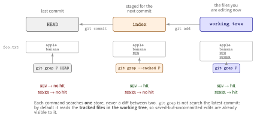

::: {.callout-note}
## TL;DR

- `git grep PATTERN` searches the **tracked files in the working tree**
- `git grep PATTERN HEAD` searches the **blobs in the `HEAD` commit**
- `git grep --cached PATTERN` searches the **index**
- None of the three searches untracked files. Add `--untracked` for that

:::{.code-area}

```bash
# did my uncommitted edits introduce this string, or was it already committed?
git grep 'TODO'        # working tree: what I have now
git grep 'TODO' HEAD   # HEAD: what I last committed
```

:::

:::


## 🎯 Goal

- [ ] Know which store each of `git grep` / `git grep --cached` / `git grep HEAD` reads
- [ ] Know that untracked files need `--untracked`


## 🔎 Objective

`git grep` earns its keep when you are about to change something, or have just changed it.
Before a refactor you want every call site of the symbol you are about to rename; after the
refactor you want to confirm none survived. Both are questions about the code **in front of
you**, which is exactly what `git grep` answers faster than `grep -r`, **because it skips
gitignored paths and `.git/` for free**.

The trap shows up the moment the question shifts from *"what does the code say"* to *"did
**I** do that"*. Suppose a `TODO` marker turns up in a review:

:::{.code-area}

```bash
$ git grep 'TODO'
src/worker.py:41:    # TODO: retry on timeout
```

:::

Is that marker something you just added and forgot to commit, or has it been in `main` for
months? A single `git grep` cannot tell you, because it only ever looked at one version of
the file.


## Where each command looks

Git keeps your file in three places at once, and each form of `git grep` reads exactly one
of them.

{fig-align="center" width="96%"}

:::{.no-border-top-table .pb-3}

| Command | Searches | uncommitted edits | untracked |
|---|---|---|---|
| `git grep PATTERN` | Tracked files in the working tree | ✓ | ✗ |
| `git grep --cached PATTERN` | The index (staging area) | ✓ staged only | ✗ |
| `git grep PATTERN HEAD` | Blobs in the `HEAD` commit | ✗ | ✗ |
| `git grep --untracked PATTERN` | Working tree **plus** untracked files | ✓ | ✓ |

: {tbl-colwidths="[33,32,20,15]"}

:::

The [official documentation](https://git-scm.com/docs/git-grep) describes the search space as
*"tracked files in the work tree, blobs registered in the index file, or blobs in given tree
objects"*, and for the `<tree>` argument: *"Instead of searching tracked files in the working
tree, search blobs in the given trees."*


## Walking through

Set up a file whose three stores disagree:

:::{.code-area}

```bash
mkdir sandbox-git-grep && cd sandbox-git-grep
git init

printf 'apple\nbanana\n' > foo.txt
git add foo.txt && git commit -m"initial commit"

echo "NEW"   >> foo.txt   # then stage it
git add foo.txt
echo "NEWER" >> foo.txt   # left in the working tree only
```

:::

Which leaves:

:::{.code-area}

```text
HEAD          apple, banana                 (neither NEW nor NEWER)
index         apple, banana, NEW            (NEW only)
working tree  apple, banana, NEW, NEWER     (both)
```

:::

[Searching for `NEW`]{.mini-section}

`NEW` was staged, so everything except `HEAD` finds it:

:::{.code-area}

```bash
$ git grep NEW
foo.txt:NEW
foo.txt:NEWER

$ git grep --cached NEW
foo.txt:NEW

$ git grep NEW HEAD
# ⚠️ nothing: HEAD still holds only apple and banana
```

:::

[Searching for `NEWER`]{.mini-section}

`NEWER` was never staged, so only the working tree has it:

:::{.code-area}

```bash
$ git grep NEWER
foo.txt:NEWER

$ git grep --cached NEWER
# ⚠️ nothing: not staged

$ git grep NEWER HEAD
# ⚠️ nothing: not committed
```

:::

[Searching backwards, for a line you removed]{.mini-section}

The relationship runs the other way too. Overwrite `foo.txt` so `banana` is gone from disk
but still in the last commit:

:::{.code-area}

```bash
$ printf 'apple\norange\n' > foo.txt

$ git grep banana
# ⚠️ nothing: the working tree no longer has it

$ git grep banana HEAD
HEAD:foo.txt:banana

$ git grep orange
foo.txt:orange

$ git grep orange HEAD
# ⚠️ nothing: never committed
```

:::

Running the two commands side by side is what makes the pair useful — the difference between
their outputs *is* the answer to "did my uncommitted work introduce or remove this string".


### Untracked files need `--untracked`

A brand-new file that has never been `git add`ed has no index entry, so none of the three
forms above will look at it. The documentation is explicit: `--untracked` means *"In addition
to searching in the tracked files in the working tree, search also in untracked files."*

:::{.code-area}

```bash
$ echo "TODO: wire this up" > scratch.py   # never added

$ git grep TODO
# ⚠️ nothing

$ git grep --untracked TODO
scratch.py:TODO: wire this up
```

:::

This mirrors `git diff`, which also ignores untracked files —
see [OGG... What's the difference between `git diff`, `git diff --cached`, and `git diff HEAD`?](../2026-05-14-git-diff-vs-diff-HEAD/index.qmd).


## Summary

:::{.no-border-top-table}

| Goal | Command |
|---|---|
| Search the code as it is on disk right now | `git grep PATTERN` |
| Search what the next commit would contain | `git grep --cached PATTERN` |
| Search the last committed state | `git grep PATTERN HEAD` |
| Search an older commit, branch, or tag | `git grep PATTERN <tree-ish>` |
| Include files never added to Git | `git grep --untracked PATTERN` |
| Find *which commit* added or removed a line | `git log -G PATTERN` |

: {tbl-colwidths="[55,45]"}

:::


## 📘 Glossary

::: {.glossary-container}

```yml
- def: Working tree
  description: |
    The files as they exist on disk in your checkout. `git grep` with no
    tree-ish reads these, restricted to the ones Git tracks, so saved but
    uncommitted edits are visible to it.

- def: Index (staging area)
  description: |
    The snapshot `git add` writes to and `git commit` turns into a commit.
    `git grep --cached` searches the blobs registered here.

- def: tree-ish
  description: |
    Any argument Git can resolve to a tree object — `HEAD`, `HEAD~1`, a
    branch name, a tag, a raw SHA. `git grep PATTERN <tree-ish>` searches
    the blobs in that tree instead of the working tree.

- def: Untracked file
  description: |
    A file with no index entry, because it has never been `git add`ed.
    Invisible to `git grep`, `git grep --cached`, and `git grep HEAD`
    alike; `--untracked` is what brings it into the search.
```

:::


📘 References
---------

- [Git Documentation > git-grep](https://git-scm.com/docs/git-grep)
- [OGG... How do I find which commits added or removed a string?](../2026-09-08-git-grep-commit/index.qmd)
- [OGG... What's the difference between `git diff`, `git diff --cached`, and `git diff HEAD`?](../2026-05-14-git-diff-vs-diff-HEAD/index.qmd)
